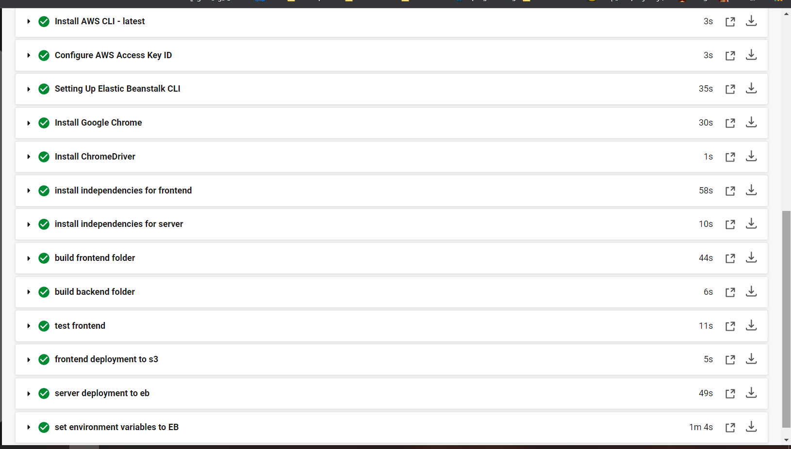
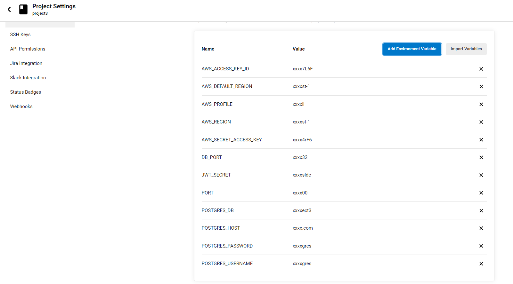

# pipline

- ***___circleci success___***

- ***___circleci variables___***

### proccess automation:
1. sign up environment
2. checkout code (geting code from github)
3. installing Node.js
4. installing AWS CLI
5. configuration to AWS CLI with access-key-id, secret-access-key and region
6. installing elastic beanstalk
7. installing independencies for server
8. installing independencies for frontend
9. building front-end folder
10. building back-end folder
11. testing application
12. deploying application to elastic beanstalk
13. deploying static files to s3
14. set environment variables to elastic beanstalk for connection with database

### diagram for this proccess
