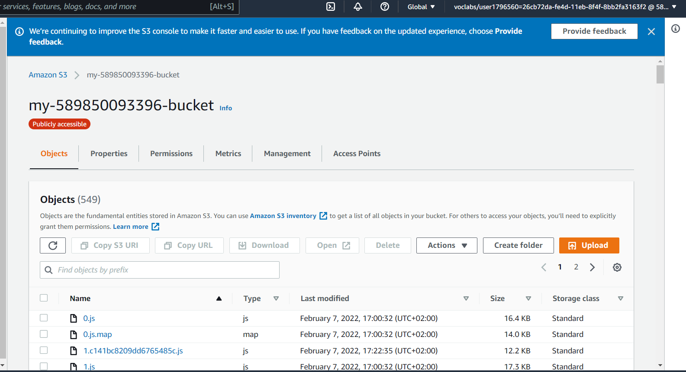
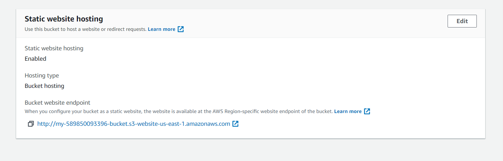
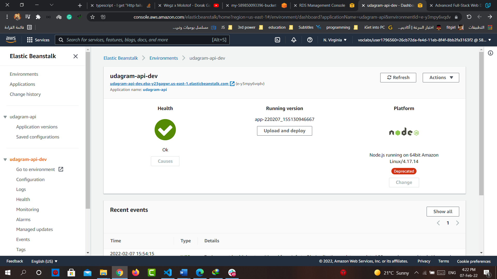
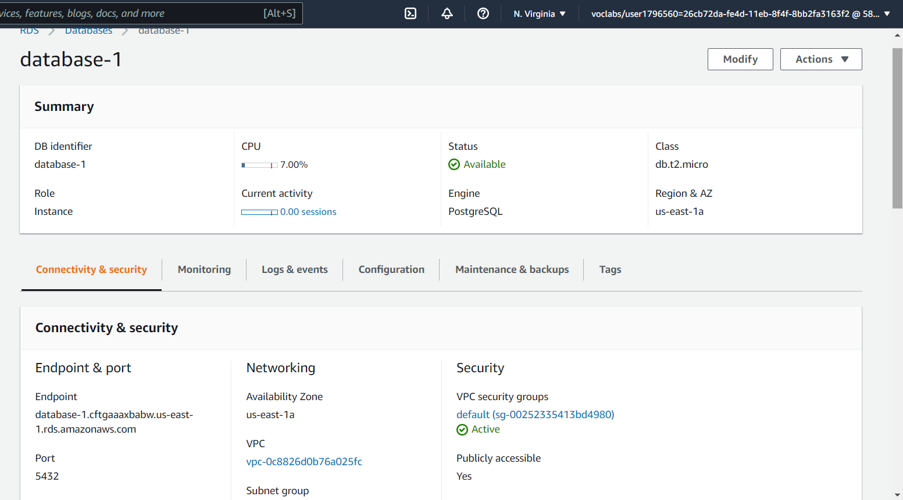
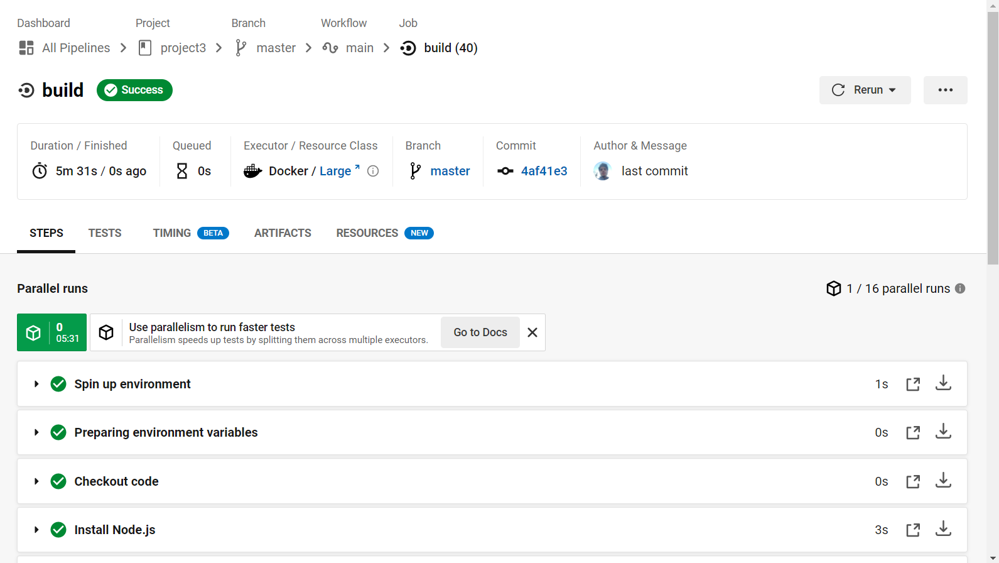
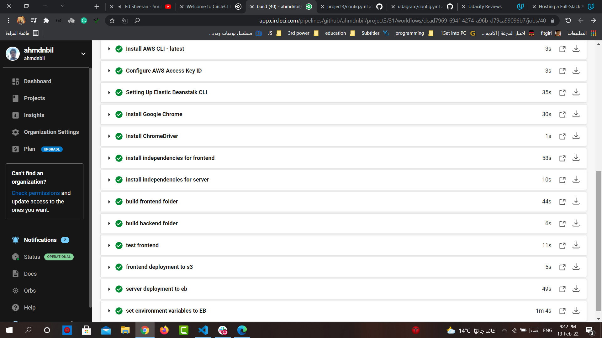
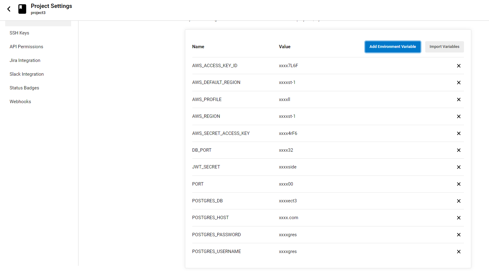
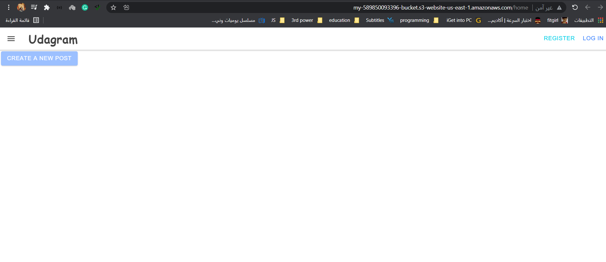

## Udagram
 - this program is used to create users and make posts containing images and some plain text
 - first of all i have tested the application on my local machine by the follwoing steps:
     - Creating database by the following command `create database udagram` in psql terminal
     - And adding the variables in .env file and testing it
     - after making that we install the dependencies of front-end and server
     - building fronend and serve
     - initating the server and front end and testing them
     - once they work propely we now could deploy the project
 - second: we deploy our project to the internet by aws servies by the following steps:
     - makin application ec2 by the following steps:
       - `eb init` to create the application 
       - `eb create` to make the environment
       - `eb use <name of environment>` for making the application uses the environment
       - `eb deploy <environmnet name>` for any update to our application
       - ```note``` we edit config of folder elasticbeanstalk by adding this section:
           - ```
             deploy:
             artifact: <root of folder>
             ```
     - making the rds throw the console by the configuration we want and copying the host of it
     - make the `S3` bucket for static files like JS, HTML and CSS by the following steps:
        - `aws s3 mb s3://<name of bucket> --region <region>`
        - `aws s3 cp --recursive public-read s3://<name of bucket>` 
     - finally we make sure the we have passed the environment variables to EB 

### Port
- Database: `5432`

### Website
- link: http://my-589850093396-bucket.s3-website-us-east-1.amazonaws.com


### screenshots
- ***screenshots for S3***



- ***screenshots for EB***


- ***__screenshots for database__***


- ***screenshots for circleci***
    1. 
    2. 
    3. 

- ***screenshot for website***
